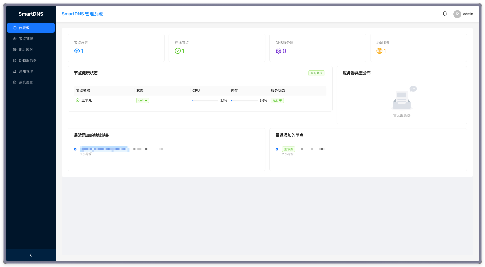
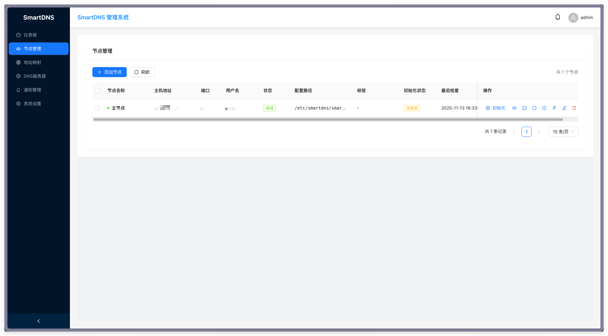
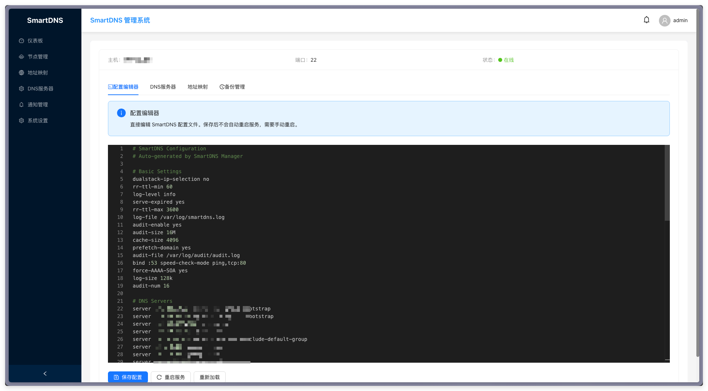
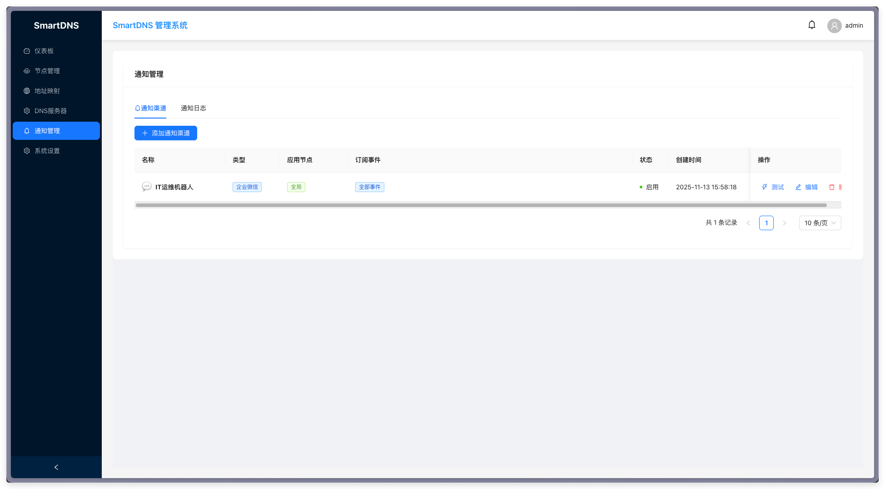

# SmartDNS Manager

[](https://hub.docker.com/r/almightyyantao/smartdns-manager)
[](LICENSE)
[](https://github.com/almightyyantao/smartdns-manager/releases)

一个功能强大的 SmartDNS 集中管理平台，支持多节点管理、配置同步、实时监控和消息推送。



## ✨ 主要特性

### 🎯 核心功能

- **多节点管理** - 集中管理多个 SmartDNS 节点，统一配置和监控
- **配置同步** - 自动同步配置到所有节点，支持批量操作
- **实时监控** - 实时查看节点状态、资源使用情况和服务运行状态
- **可视化配置** - 通过 Web 界面直观地管理 DNS 服务器和地址映射
- **配置备份** - 自动备份配置文件，支持一键恢复
- **消息推送** - 支持企业微信、钉钉、飞书等多种通知渠道

### 🔧 管理功能

- ✅ DNS 服务器管理（UDP/TCP/TLS/HTTPS）
- ✅ 地址映射管理（域名到 IP 映射）
- ✅ 域名集管理（分组管理域名）
- ✅ 域名规则管理
- ✅ 配置模板管理
- ✅ 批量导入导出

### 🚀 运维功能

- ✅ 一键初始化节点（自动安装 SmartDNS）
- ✅ 远程重启服务
- ✅ 日志实时查看
- ✅ 配置同步状态追踪
- ✅ 节点健康检查
- ✅ 性能监控（CPU、内存、磁盘）

### 📱 通知功能

- ✅ 配置同步成功/失败通知
- ✅ 节点上线/离线通知
- ✅ 服务异常告警
- ✅ 支持企业微信、钉钉、飞书、Slack
- ✅ 自定义事件订阅

## 📸 系统截图

### 仪表板


### 节点管理


### 配置管理


### 通知管理


## 🏗️ 技术栈

### 后端
- **Go 1.21+** - 高性能后端服务
- **Gin** - Web 框架
- **GORM** - ORM 框架
- **SQLite** - 轻量级数据库
- **SSH** - 远程节点管理

### 前端
- **React 18** - 用户界面
- **Ant Design 5** - UI 组件库
- **Axios** - HTTP 客户端
- **React Router** - 路由管理
- **Monaco Editor** - 代码编辑器

## 🚀 快速开始

### 方式一：Docker Compose（推荐）

#### 前置要求
- Docker 20.10+
- Docker Compose 2.0+

#### 部署步骤

1. **克隆项目**
```bash
git clone https://github.com/almightyyantao/smartdns-manager.git
cd smartdns-manager